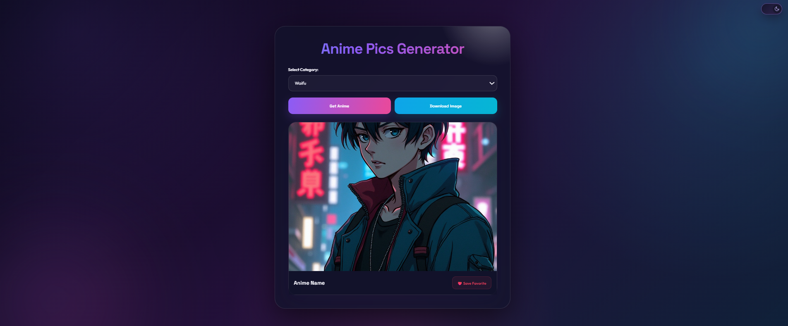

# 🎌 Anime Pics Generator

> A responsive web application that dynamically generates random anime pictures using a public API.

[](https://developer.mozilla.org/en-US/docs/Web/HTML)
[](https://developer.mozilla.org/en-US/docs/Web/CSS)
[](https://developer.mozilla.org/en-US/docs/Web/JavaScript)

## 📌 Overview

**Anime Pics Generator** is a lightweight frontend project built to practice working with APIs and dynamic content in JavaScript.

Users can generate random anime pictures with a single click. The application sends a request to an image API, processes the response, and dynamically updates the webpage with the returned image.

## ✨ Key Features

* 🎌 Random anime picture generation
* 🌐 API integration
* ⚡ Dynamic content loading
* 🖱️ Interactive user interface
* 📱 Responsive layout
* 🎨 Clean and modern design
* 🔄 Generate new images without refreshing the page
* 🚀 Lightweight frontend application

## 🛠️ Tech Stack

| Technology     | Purpose                                |
| -------------- | -------------------------------------- |
| **HTML5**      | Application structure                  |
| **CSS3**       | Styling and responsive layout          |
| **JavaScript** | Application logic and DOM manipulation |
| **Fetch API**  | Communicating with the external API    |

## 🧠 Concepts Practiced

This project was created to strengthen practical JavaScript skills, including:

* DOM Manipulation
* Event Listeners
* Functions
* Fetch API
* Promises
* Async/Await
* JSON Data
* API Integration
* Dynamic Image Rendering
* Error Handling
* Responsive Web Design

## 📂 Project Structure

```text
anime-pics-generator/
│
├── index.html
├── style.css
├── script.js
├── preview.png
└── README.md
```

## ⚙️ How It Works

The application follows a simple workflow:

```text
User clicks Generate
        ↓
JavaScript sends API request
        ↓
API returns anime image data
        ↓
JavaScript processes the response
        ↓
Image is displayed on the webpage
```

## 🖼️ Preview



## 🚀 Getting Started

### 1. Clone the repository

```bash
git clone https://github.com/muhammadahmad152/anime-pics-generator.git
```

### 2. Open the project

```bash
cd anime-pics-generator
```

### 3. Run the application

Open `index.html` in your browser.

No backend server or installation is required.

## 🔮 Future Improvements

Planned improvements for future versions:

* [ ] Add multiple anime categories
* [ ] Add loading animation
* [ ] Improve API error handling
* [ ] Add favorite images
* [ ] Add image download functionality
* [ ] Add dark/light mode
* [ ] Improve accessibility
* [ ] Add more advanced UI/UX interactions

## 🎯 Project Goal

The main goal of this project was to gain practical experience with **JavaScript API integration and dynamic web applications** while building a project suitable for a frontend development portfolio.

## 👨‍💻 Author

**Muhammad Ahmad**

Aspiring Software Engineer | Web Development | Future Cyber Security & AI Professional

### 🔗 Connect With Me

* GitHub: https://github.com/muhammadahmad152
* LinkedIn: https://www.linkedin.com/in/muhammad-ahmad-khan-419101367/

---

⭐ **If you found this project useful, consider giving it a star!**

> Built with HTML, CSS & JavaScript 🚀
